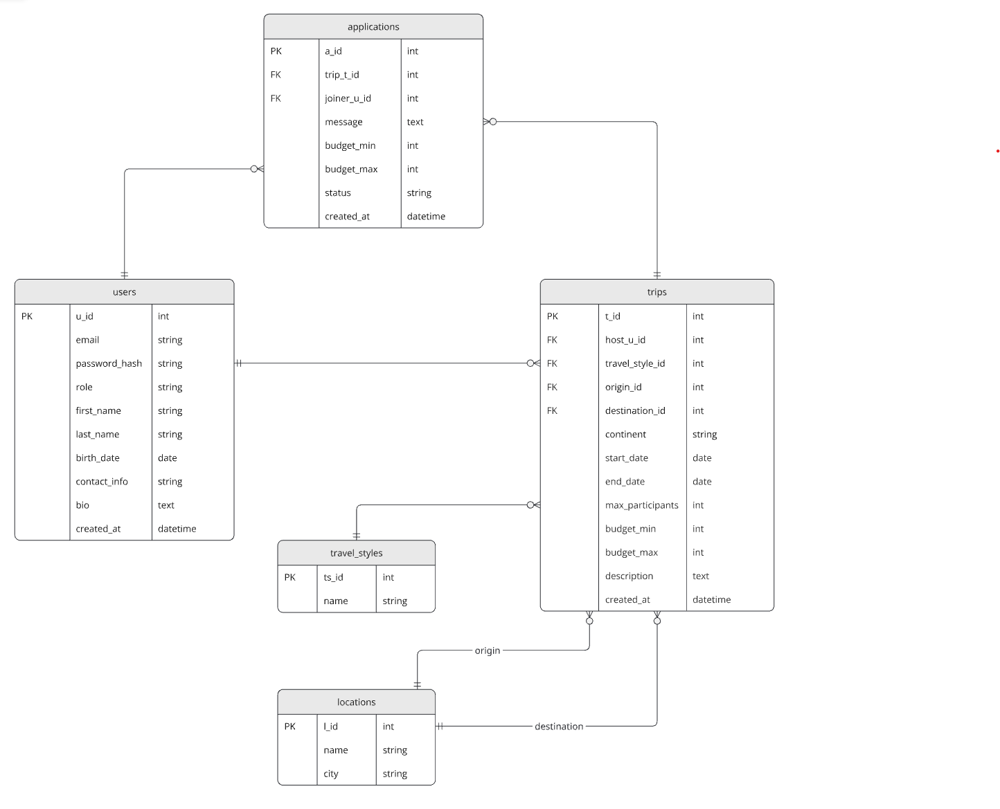

{: .no_toc }
# Data Model

Table of contents

+ ToC
{: toc }
{: .text-delta }

##Übersicht

TravelMate verwendet eine SQLite-Datenbank mit fünf Tabellen, die über Fremdschlüssel miteinander verknüpft sind.

## Tabellen

### users
Speichert alle registrierten Nutzer der Plattform. Jeder Nutzer hat eine eindeutige E-Mail-Adresse, ein gehashtes Passwort sowie Profilfelder wie Name, Geburtsdatum, Bio und Kontaktinformationen. Die Rolle (`role`) ist für alle Nutzer einheitlich auf `user` gesetzt. Die Autorisierung erfolgt über `@login_required`.

### trips
Speichert alle erstellten Reisen. Jede Reise gehört genau einem Host (`host_u_id` → `users.u_id`) und hat einen Reisestil, ein Start- und Enddatum, ein Budget sowie eine maximale Teilnehmerzahl. Der Start- und Zielort werden jeweils als Fremdschlüssel auf die `locations`-Tabelle gesetzt (`origin_id` und `destination_id`).

### applications
Speichert alle Bewerbungen von Joinern auf Reisen. Jede Bewerbung verknüpft einen Nutzer (`joiner_u_id` → `users.u_id`) mit einem Trip (`trip_t_id` → `trips.t_id`). Ein Joiner kann sich pro Trip nur einmal bewerben (UniqueConstraint auf `trip_t_id` + `joiner_u_id`). Der Status einer Bewerbung (`pending`, `accepted`, `rejected`) ist standardmäßig `pending`.

### locations
Speichert Reiseorte mit Name und Stadt. Diese Tabelle wird von `trips` zweimal referenziert — einmal als Startpunkt (`origin_id`) und einmal als Zielort (`destination_id`).

### travel_styles
Speichert die verfügbaren Reisestile. Jeder Trip wird genau einem Reisestil zugeordnet (`travel_style_id` → `travel_styles.ts_id`).

## Beziehungen

| Von | Zu | Typ | Beschreibung |
|---|---|---|---|
| users | trips | 1:n | Ein Nutzer kann mehrere Trips als Host erstellen |
| users | applications | 1:n | Ein Nutzer kann sich auf mehrere Trips bewerben |
| trips | applications | 1:n | Ein Trip kann mehrere Bewerbungen erhalten |
| travel_styles | trips | 1:n | Ein Reisestil kann mehreren Trips zugeordnet sein |
| locations | trips (origin) | 1:n | Ein Ort kann Startpunkt mehrerer Trips sein |
| locations | trips (destination) | 1:n | Ein Ort kann Zielort mehrerer Trips sein |
