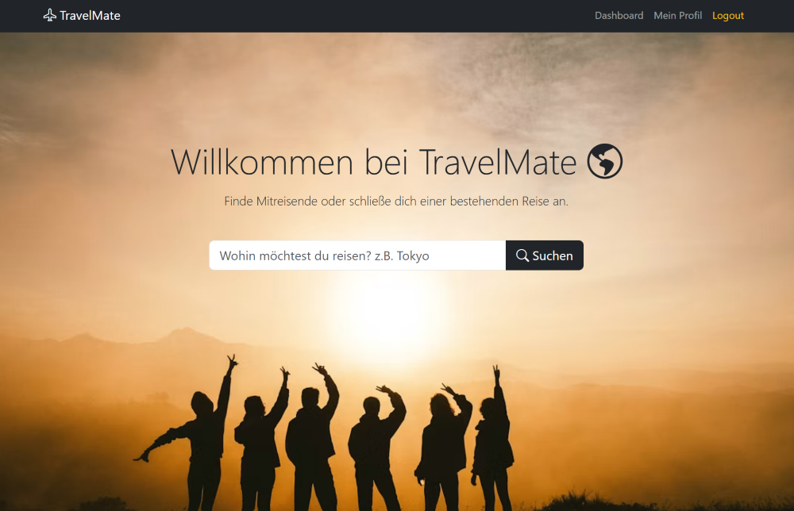
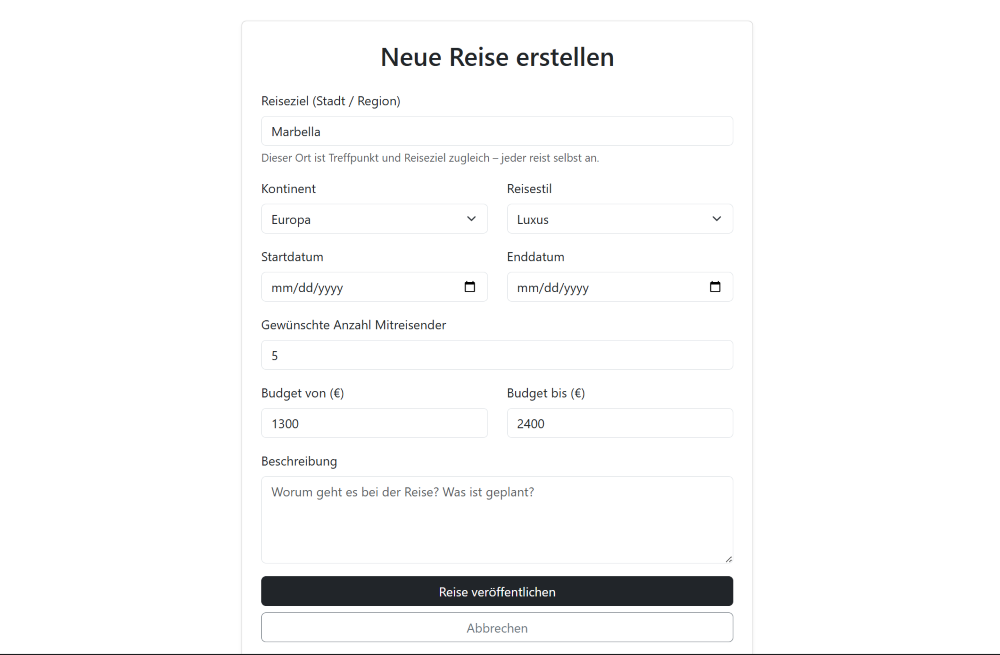
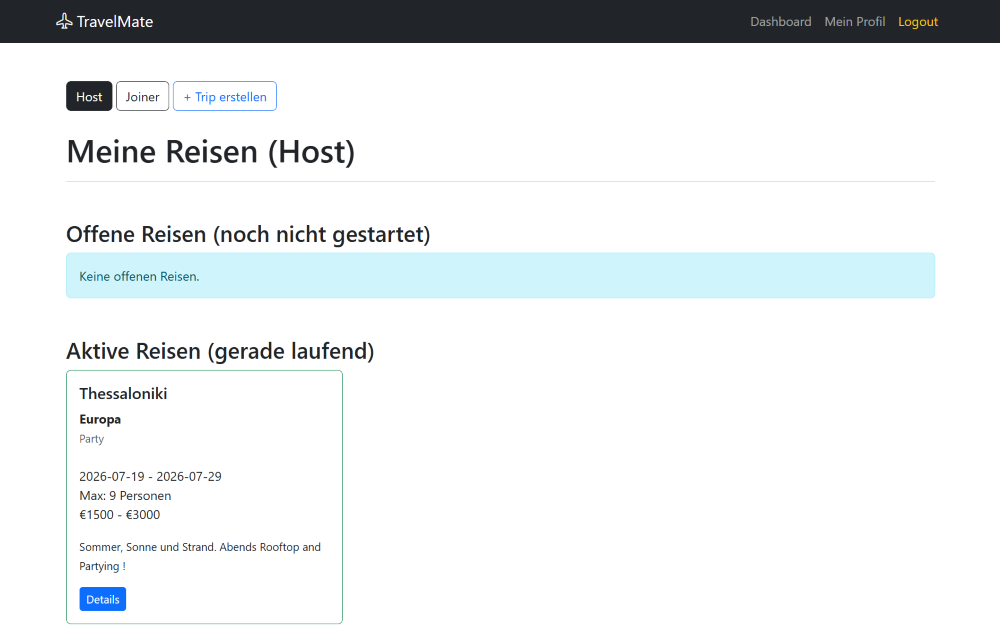
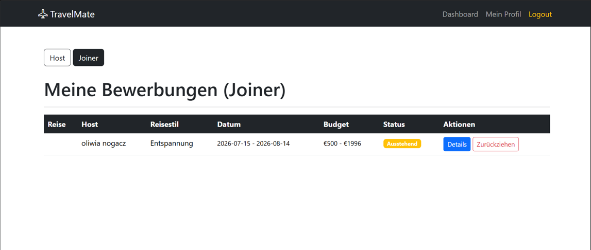

# TravelMate

TravelMate ist eine zweiseitige Reiseplattform, die Menschen miteinander verbindet, die Reisen organisieren möchten, und Personen, die nach passenden Reisepartnern suchen. Nutzer können eigene Reisen erstellen, verfügbare Trips durchsuchen und sich auf Reisen bewerben, die ihren Interessen, ihrem Budget und ihren Reisevorstellungen entsprechen.

Die Plattform löst das häufige Problem, geeignete Mitreisende zu finden, indem sie einen strukturierten Matching-Prozess zwischen Reise-Hosts und Reisenden als Joiner ermöglicht. Hosts können Bewerbungen verwalten und Teilnehmer auswählen, während Reisende den Status ihrer Bewerbungen über ein persönliches Dashboard verfolgen können.

## Sample App Screen

---

## Improvements / Refinements since First Submission

**Buttons & Navigation ergänzt**

+ "Details"-Buttons in Host und Joiner Dashboard verlinkt
+ "Trip erstellen"-Button im Host Dashboard 
+ Abbrechen-Button im Trip erstellen Formular
+ Löschen-Button für eigene Reisen (Host Dashboard)  mit Sicherheitsabfrage (confirm())
+ Zurückziehen-Button für Bewerbungen (Joiner Dashboard)
+ Zurück-Button per history.back()

---
**Neue Funktionen**

+ Eigene Reisen löschen (delete_trip in trips.py): 
    + nur der Host darf löschen
    + zugehörige Bewerbungen werden zuerst entfernt (Foreign-Key-Constraint)
    + dann die Reise
+ Bewerbungen annehmen/ablehnen mit statusabhängiger Farbanzeige in host_dashboard.html
+ Bewerbung zurückziehen für Joiner (Logik in applications.py, Button in joiner_dashboard.html)
+ Enddatum-Filter in der Reisesuche 

---
**Validierung & Sicherheit**

+ try/except-Blöcke für Datums- und Zahleneingaben in trips.py (Trip-Erstellung) und für Budgeteingaben in applications.py (Bewerbung)
+ Prüfungen in applications.py: 
    + keine Bewerbung auf die eigene Reise
    + keine Doppelbewerbung
    + Prüfung ob die Reise bereits voll ist

---
**Feinschliff, Fehlerbehebungen & Dokumentation**

+ Landing Page überarbeitet (dunkle Values-Sektion mit Farbverlauf)
+ Login-Seite und Register-Card: Abstände und Platzierung verbessert
+ Dashboard-Karten zeigen Stadt statt nur Kontinent (host_dashboard.html)
+ Diverse Formatierungskorrekturen (Spacing, Container, Proportionen)
+ Falsch angezeigter Name in Bewerbungen korrigiert
+ TemplateSyntaxError behoben (Jinja-Klammern aus HTML-Kommentaren)
+ Quellen im Code und in der Doku ergänzt
+ Sample App Screenshots eingefügt
---

{: .fs-2 }
Last build: {{ site.time | date: '%d %b %Y, %R%:z' }}